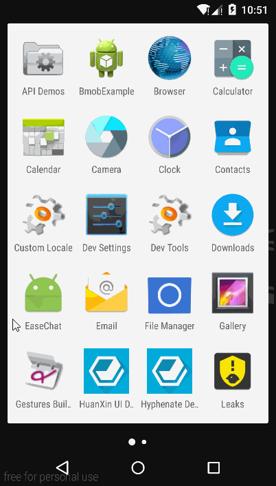

# EaseChat

### 前言
环信已经发部了`SDK3.x`版本，`SDK3.x`相对于`SDK2.x`来说是整个进行了重写，`API`变化还是比较大的，已经熟悉`SDK2.x`的开发者在使用新的`SDK3.x`还是会遇到不少问题的，不过还好官方给出了`SDK2.x`升级`SDK3.x`指南，已经熟悉`SDK2.x`开发者可以根据文档了解`SDK3.x`的变化，新集成的开发者可以直接参考`SDK3.x`进行集成；
这里简单的实现了sdk的初始化以及注册登录和收发消息，不过ui上没有没有去做很好的处理

### 先看效果图   
    

### 提供一些地址  

如果你还是用的`Eclipse`，可以下载`AndroidStudio`尝试下，如果你上不了`Android`官网，不懂怎么翻墙可以找下国内开发提供的一些地址

* AndroidStudio下载   
[Android官方下载](http://tools.android.com/download/studio/builds/2-0)  
[国内提供 AndroidDevTools](http://androiddevtools.cn/)  

* 模拟器 Genymotion下载  
[Genymotion 官网](http://genymotion.com/) 

* 环信官方文档
[SDK3.x 文档](http://docs.easemob.com/im/start)   
[SDK3.x API 文档](http://www.easemob.com/apidoc/android/chat3.0/annotated.html)   
[SDK2.x 升级 SDK3.x 文档](http://docs.easemob.com/im/200androidcleintintegration/140upgradetov30)   

### 说下我当前开发环境
这里并不是一定要按照我的配置来，只是说下当前项目开发运行的环境，如果你的开发环境不同可能需要自己修改下项目配置`build.gradle`文件 
>AndroidStudio 2.1.2  
Gradle 2.10（跟随AndroidStudio 一起更新）   
Android SDK Tool 25.1.7 
Android Build-tools 24.0.1  
Android Support 最新  
Genymotion 2.6.0  

* 项目详细介绍
[项目文章详细介绍](http://www.jianshu.com/p/3e732f45d376)  

